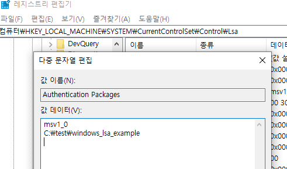
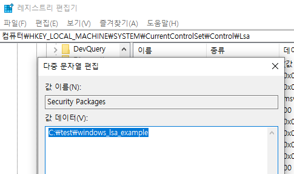
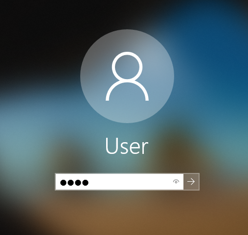

# Warning

This is not working now! Also, The names(e.g. SSP/AP, LSA and etc) may also be incorrect.

I am working in progress.

# Build

```
> mkdir build
> cd build
> cmake ..
> cmake --build .
```

# Installation DLL

## As Authentication Package



## As Security Package



# Test Result

Progress : Change Registry -> Reboot -> Logon

**LOGON**



## Authentication Package

```txt
2022-02-24 19:22:07.642 INFO  [644] [DllMain@21] start
2022-02-24 19:22:07.644 DEBUG [644] [LsaApInitializePackage@29] LsaApInitializePackage Called
2022-02-24 19:23:10.155 INFO  [684] [LsaApLogonTerminated@74] LsaApLogonTerminated
```

## Security Package

```txt
2022-02-24 19:24:47.815 INFO  [640] [DllMain@21] start
2022-02-24 19:24:47.816 DEBUG [640] [SpInitialize@8] SpInitialize
2022-02-24 19:24:47.816 DEBUG [640] [SpGetInfo@19] SpGetInfo
```